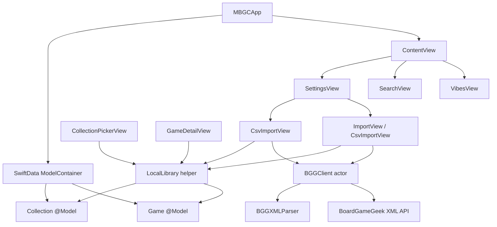

# iOS foundation review

Date: 2026-06-26

Scope: `ios/MBGC`, `ios/MBGCTests`, `features/ios/bgg-import.feature.yaml`, and `ios/AGENTS.md`.

Goal: simple, secure, maintainable, local-first iOS foundation with small functions, low duplication, and no speculative architecture.

## Executive summary

The iOS app has a good base: local-first SwiftUI + SwiftData, no backend auth, one paced BGG actor client, small view-facing models, and zero third-party dependencies.

The best foundation is to keep this shape.

Do not add a DI framework, repository layer, networking abstraction stack, or global app router yet.

The main issues were not architectural size. They were small correctness and drift problems:

- Imports could create local `Game` rows that were not in Library if the destination picker was canceled.
- Some save failures were silently dropped or written to hidden state.
- BGG user-facing errors could expose raw transport/parser text.
- BGG cooldown was recorded even when no new games imported, which drifted from `bgg-import.LIMITS.2`.
- `ios/AGENTS.md` and the feature spec mention Keychain token storage, but the current code reads a build-time `BGGToken` from `Info.plist`.

## Current architecture



The app should stay Model-View:

- SwiftData models own persisted state.
- Views orchestrate UI state with `@State`, `@Query`, `.task`, sheets, and local helpers.
- Tiny `@Observable` models are acceptable where they own edit/save state.
- Shared operations belong in small domain helpers like `LocalLibrary`, not in broad generic services.

## Class and type inventory

| Type | Role | Review |
|---|---|---|
| `MBGCApp` | App entry and SwiftData container. | Good. URL cache bump is a simple native fix for image caching. |
| `Game` | SwiftData game model keyed by unique `bggId`. | Good local primary key. Legacy DTO fields remain but should be deleted when backend sync is truly gone. |
| `GameDTO`, `GameDetailDTO`, `VibeRefDTO` | Legacy backend DTOs. | Useful only while old API compatibility matters. Mark for deletion after local-first stabilizes. |
| `Collection` | SwiftData collection/vibe model. | Good. `isDefault` is the Library invariant. |
| `LocalLibrary` | Shared local library operations. | Added to remove duplicate existing-ID fetches and prevent orphan imports. Keep small. |
| `BGGGame` | Intermediate parsed BGG value. | Now `Sendable` for actor boundary correctness. |
| `BGGClient` | Actor for BGG HTTP calls, pacing, retry, batch fetch. | Good. Keep serial and conservative. User-facing messages are centralized on `BGGError.userMessage`. |
| `BGGXMLParser` | XMLParser delegates for collection and thing XML. | Good for no-dependency XML. Needs more parser tests before broadening metadata. |
| `VibesViewModel` | Collection CRUD state. | Small and acceptable. Some sheet paths still do direct saves because passing this model into sheets is not worth extra plumbing yet. |
| `ProfileViewModel` | BGG username UserDefaults state. | Small. Duplicate username key with `ImportView` should be centralized if settings grow. |
| `GameDetailViewModel` | Local game detail editing and deletion state. | Better after save error handling. Library can no longer be removed from a game. |
| `ContentView` | Root tab shell, Library seed, global sheets. | Good enough. A full router is not needed yet. |
| `HomePillView` | Custom tab pill. | Fine. Watch Dynamic Type and VoiceOver labels before release. |
| `LibraryView` | Discover placeholder. | Placeholder only. No architecture concern. |
| `SearchView` | Local in-memory search over `@Query` games. | Fine for current scale. Move to SwiftData predicate only when library size makes this slow. |
| `SettingsView` | Navigation to import flows. | Good. |
| `ProfileView` | Username form. | Good but not linked from current settings. Either surface it or delete until needed. |
| `ImportView` | BGG username sync and import workflow. | Better after Library assignment and cooldown fix. Still the largest workflow file. Split only when it hurts. |
| `CsvImportView` | CSV parse, preview, BGG fetch, local insert. | Good enough. Parser has known escaped-quote limits. |
| `CollectionPickerView` | Shared imported-game destination picker. | Good shared component. Now shows save errors and duplicate-safe adds. |
| `VibesView` | Collection list and collection sheets. | Dead create sheet state removed. Create/rename now trim and show save errors. |
| `CreateCollectionSheet`, `RenameCollectionSheet` | Collection forms. | Duplicate but acceptable at two forms. Extract one form only if a third path appears. |
| `CollectionDetailView` | List games in a collection. | Good. Consider stable sorting if users expect alphabetical order. |
| `GameDetailView` | Game details and collection membership editing. | Good enough. Has some duplicated row/chip styling with other views. |
| `FlowLayout` | Local tag wrapping layout. | Fine. Keep local until another screen needs it. |

## Fixes applied in this pass

- Added `LocalLibrary.ensureDefaultCollection`, `existingBggIds`, and duplicate-safe `add`.
- BGG and CSV imports now add new games to Library before showing the destination picker.
- Canceling the destination picker no longer leaves new imports invisible from Library.
- `CollectionPickerView` now renders save failures.
- `CsvImportView` now renders import failures.
- `GameDetailViewModel` no longer ignores collection/rules save failures.
- Library membership is non-removable from game detail editing.
- `CreateCollectionSheet` and `RenameCollectionSheet` trim collection names and show save failures.
- Removed dead `VibesView.showCreate` state and `showCreateSheet`.
- `BGGError.userMessage` gives stable user-facing errors without raw transport/parser details.
- BGG import cooldown is recorded only after games actually import, matching `bgg-import.LIMITS.2`.
- `BGGGame` is `Sendable`.

## Spec and doc drift

`features/ios/bgg-import.feature.yaml` says:

- `bgg-import.SECURITY.4`: user-provided BGG API token is stored only in Keychain.

Current code:

- Reads `BGGToken` from `Info.plist`.
- Expands the value from `BGG_TOKEN` in `Secrets.xcconfig`.
- Has no `Keychain.swift` file.

`ios/AGENTS.md` also lists `Keychain.swift` and Keychain token storage, but the file is absent.

Decision needed:

- If the app uses a build-time public API token, update the feature spec and `ios/AGENTS.md`.
- If the app needs user-provided tokens, add a minimal Keychain helper and token entry UI.

Security note: anything in the app bundle, including `Info.plist`, is extractable. Treat `BGG_TOKEN` as an app identifier/public token, not a secret.

## Security review

Good:

- No backend JWT or login flow in the iOS app.
- BGG calls use HTTPS.
- Username and sync date in UserDefaults are low sensitivity.
- No third-party dependencies.
- URLSession has bounded request/resource timeouts.
- BGG request pacing is conservative.

Needs attention:

- Bundle token is not secret. Resolve spec/doc drift.
- `BGGError.errorDescription` still includes raw details. Do not render it directly in UI.
- BGG XML description is rendered as text after manual unescape. That is safe in SwiftUI, but parser coverage should grow.
- CSV parsing is simple and may mishandle escaped quotes. That is correctness risk, not code execution risk.
- External image URLs are rendered by `AsyncImage`; acceptable for BGG, but avoid allowing arbitrary user-supplied URL schemes in future fields.

## Performance review

Good:

- `BGGClient` is an actor and serializes network batches.
- `fetchThings` batches IDs by 20 with pacing.
- `List` is used for collection/search result lists.
- `URLCache.shared` is increased instead of adding a custom image loader.
- SwiftData local reads keep UI fast for current scale.

Watch later:

- `SearchView` filters all games in memory. Fine now; use a SwiftData predicate if local libraries reach thousands of games and search janks.
- `LocalLibrary.existingBggIds` fetches all games. Fine now; use a `bggId IN (...)` predicate when SwiftData predicate ergonomics are worth it.
- `Collection.games.count` can become expensive if collections grow very large. Measure before changing.
- Parser tests only cover collection IDs. Add thing XML tests before changing parser logic.

## Foundation rules

Keep:

- Local-first SwiftData.
- One BGG actor client.
- `@Observable`, not `ObservableObject`.
- Views plus small domain helpers.
- No generic repository layer until there are two real data backends.
- No DI framework.
- No new dependencies for CSV/XML unless real BGG data breaks the current parser.

Unify only when the third duplicate appears:

- `GameRow` shared between search and collection detail.
- `CollectionFormSheet` shared by create/rename.
- `AppStorageKeys` for UserDefaults keys.
- `BGGImportStatus` if CSV and username import converge further.

## Recommended next sequence

1. Resolve token spec drift: either update docs/spec for build-time token or implement Keychain token entry.
2. Add tests for `LocalLibrary.add` duplicate behavior and default Library creation using an in-memory SwiftData container.
3. Add BGG thing XML parser fixtures for names, descriptions, ratings, player counts, language dependence, and duplicate links.
4. Decide whether `ProfileView` is part of Settings; if not, delete it until needed.
5. Add VoiceOver labels to custom icon-only controls before release.
6. Keep `ImportView` as one file until one more workflow lands; then split the pure import logic from the view.

## Verification

```sh
xcodebuild -project MBGC.xcodeproj -scheme MBGC -destination 'platform=iOS Simulator,id=AE64B0C3-C281-4517-A4C0-06523E7C6B95' build
xcodebuild -project MBGC.xcodeproj -scheme MBGC -destination 'platform=iOS Simulator,id=AE64B0C3-C281-4517-A4C0-06523E7C6B95' test
```

Both passed on 2026-06-26.
