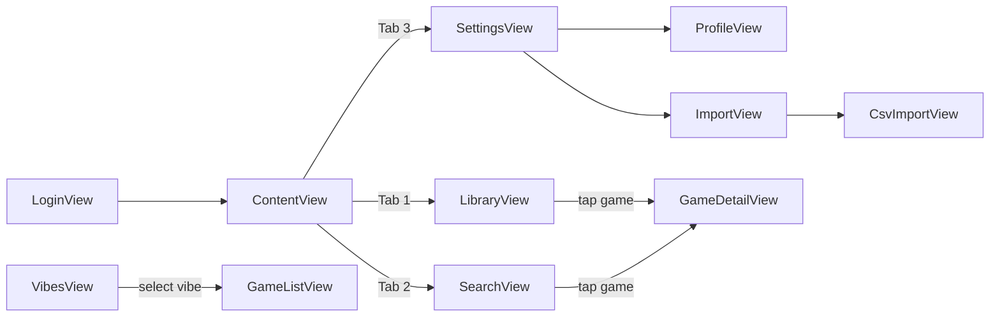

# iOS Improvement Plan — MBGC

## Context

User pain: **can't see game details** (Priority 1). Want to add pages/features from web, bare bones, no UI polish, similar to Overboard.

YAGNI applied: only features the user explicitly needs are planned. Filters, grid view, player aids deferred.

## Page Flow



## Implementation Phases

### Phase 1: Game Detail (MVP of MVPs)

**Why:** User can't see game details — #1 pain point.

**Files:**
- `ios/MBGC/Models/Game.swift` — expand to match web Game type
- `ios/MBGC/Networking/APIClient.swift` — add `getGame(id:)`, `deleteGame(id:)`, `setGameCollections(gameId:collectionIds:)`
- `ios/MBGC/ViewModels/GameDetailViewModel.swift` — new
- `ios/MBGC/Views/GameDetailView.swift` — new
- `ios/MBGC/Views/LibraryView.swift` — add `NavigationLink` to GameDetailView
- `ios/MBGC/Views/SearchView.swift` — add `NavigationLink` to GameDetailView

**YAGNI simplifications:**
- No image caching — `AsyncImage` is fine (per ios-plan.md)
- No expand/collapse description — show full text
- No weight class colors — just show number
- Delete confirmation inline — no separate screen
- No player aids — deferred

**Game model fields to add:**
```swift
// ponytail: only fields GameDetailView renders. Add more when needed.
var description: String
var image: String
var categories: [String]
var mechanics: [String]
var types: [String]
var weight: Double
var rating: Double
var languageDependence: Int
var recommendedPlayers: [Int]
```

**API calls needed:**
- `GET /api/v1/games/{id}` — game detail
- `POST /api/v1/games/{id}/collections` — assign vibes
- `PUT /api/v1/games/{id}/rules-url` — set rules URL
- `DELETE /api/v1/games/{id}` — remove game

---

### Phase 2: Profile

**Why:** Need BGG username for import. User explicitly said needed.

**Files:**
- `ios/MBGC/Networking/APIClient.swift` — add `getProfile()`, `setBGGUsername()`, `changePassword()`
- `ios/MBGC/ViewModels/ProfileViewModel.swift` — new
- `ios/MBGC/Views/ProfileView.swift` — new
- `ios/MBGC/Views/SettingsView.swift` — add NavigationLink to ProfileView

**YAGNI simplifications:**
- No avatar — just username + BGG username
- No change password for now — deferred (needs API support)

**API calls needed:**
- `GET /api/v1/profile` — current user + BGG username
- `PUT /api/v1/profile/bgg-username` — set BGG username

---

### Phase 3: Import (BGG Sync)

**Why:** User explicitly said import needed in app.

**Files:**
- `ios/MBGC/Networking/APIClient.swift` — add `syncBGG(fullRefresh:)`
- `ios/MBGC/ViewModels/ImportViewModel.swift` — new
- `ios/MBGC/Views/ImportView.swift` — new (BGG sync only, bare bones)
- `ios/MBGC/Views/SettingsView.swift` — add NavigationLink to ImportView

**YAGNI simplifications:**
- No full refresh checkbox — just single "Sync" button
- Results shown as simple text (imported/skipped/failed)
- No cancel button during sync

**API calls needed:**
- `POST /api/v1/import/sync` — sync from BGG

---

### Phase 4: CSV Import

**Why:** User explicitly said needed.

**Files:**
- `ios/MBGC/Views/CsvImportView.swift` — new (3-step: upload → preview → done)
- `ios/MBGC/Views/ImportView.swift` — add NavigationLink to CsvImportView

**YAGNI simplifications:**
- No step indicator dots — just simple flow
- No "select all" / "deselect all"
- Preview table shows name + BGG ID + status only

**API calls needed:**
- `POST /api/v1/import/csv/preview` — preview CSV
- `POST /api/v1/import/csv` — import selected

---

### Phase 5: Vibes (Collections)

**Why:** User said collections management needed.

**Files:**
- `ios/MBGC/Models/Collection.swift` — new
- `ios/MBGC/Networking/APIClient.swift` — add `listCollections()`, `createCollection()`, `updateCollection()`, `deleteCollection()`, `discover(collectionId:)`
- `ios/MBGC/ViewModels/VibesViewModel.swift` — new
- `ios/MBGC/Views/VibesView.swift` — new (browse by vibe + CRUD)
- `ios/MBGC/Views/ContentView.swift` — add Vibes tab

**YAGNI simplifications:**
- No color picker — use fixed palette
- No edit mode for vibe pills — just inline edit
- No game count badges on vibe pills — show count after selecting
- No filters on discover results

**API calls needed:**
- `GET /api/v1/collections` — list collections
- `POST /api/v1/collections` — create collection
- `PUT /api/v1/collections/{id}` — rename collection
- `DELETE /api/v1/collections/{id}` — delete collection
- `GET /api/v1/discover?collection_id=` — games by vibe

---

## Not Planning (YAGNI)

These exist in ios-plan.md but not planning until user says needed:

- Filters on library (category, players, playtime, weight)
- Grid view toggle
- Player aids (file upload for rules)
- Image caching layer
- Offline mutation queue
- Change password feature
- Discover filters (type, mechanic, etc.)

---

## Implementation Order

1. **Phase 1** — Game Detail (immediate value, unlocks the app)
2. **Phase 2** — Profile (needed for BGG sync)
3. **Phase 3** — Import (BGG sync)
4. **Phase 4** — CSV Import
5. **Phase 5** — Vibes/Collections

Each phase: implement bare minimum → test → next.

---

## API Endpoints Summary

| Method | Path | Phase |
|--------|------|-------|
| GET | /api/v1/games/{id} | 1 |
| DELETE | /api/v1/games/{id} | 1 |
| POST | /api/v1/games/{id}/collections | 1 |
| PUT | /api/v1/games/{id}/rules-url | 1 |
| GET | /api/v1/profile | 2 |
| PUT | /api/v1/profile/bgg-username | 2 |
| POST | /api/v1/import/sync | 3 |
| POST | /api/v1/import/csv/preview | 4 |
| POST | /api/v1/import/csv | 4 |
| GET | /api/v1/collections | 5 |
| POST | /api/v1/collections | 5 |
| PUT | /api/v1/collections/{id} | 5 |
| DELETE | /api/v1/collections/{id} | 5 |
| GET | /api/v1/discover?collection_id= | 5 |
